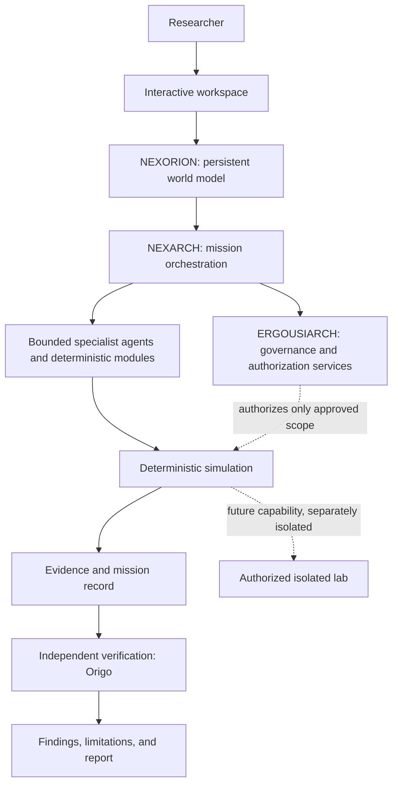

# NEXORION

**An AI-coordinated cybersecurity research and simulation universe.**

NEXORION is a proposed persistent digital environment in which a researcher can explore a modeled world, investigate security evidence, develop hypotheses, run reproducible simulations, and evaluate findings through independent verification. Its design combines an interactive world model, coordinated specialist roles, explicit governance, and a future isolated lab for authorized experiments.

> **Project status:** Research and architecture specification. The supplied repository archive contains conceptual and planning documents, not application source code or verified executable implementation. Capabilities described as planned must not be interpreted as implemented.

## The three identities

- **NEXORION — The Digital Universe:** the persistent environment and world model representing entities, relationships, missions, scenarios, evidence, and outcomes.
- **NEXARCH — The Central Intelligence:** the mission reasoning and orchestration layer that coordinates work and specialist roles.
- **ERGOUSIARCH — The Governing Authority:** the governance concept for policy, authorization, approval, and audit requirements. It is not a substitute for enforceable controls implemented in software.

## What makes the concept distinctive

- A persistent, inspectable digital world rather than a chat-only interface.
- Mission-based research with explicit objectives, scope, constraints, and completion criteria.
- Specialist roles coordinated through bounded responsibilities and defined handoffs.
- Reproducible deterministic simulations and baseline comparisons.
- Evidence provenance and independent verification separated from AI-generated hypotheses.
- A staged path from simulation to a separately isolated lab, subject to explicit authorization and safety gates.
- Adaptive multimodal interaction as a future interface direction, not a claim of current capability.

## Architecture at a glance

This diagram represents the **proposed design**, not a verified implementation. ERGOUSIARCH is a conceptual governing identity; actual enforcement must be implemented by deterministic policy and authorization controls.

## Capability maturity

| Capability | Status in supplied materials |
|---|---|
| Product concept, identities, and architecture | Documented proposal |
| Agent roles and coordination model | Documented proposal; role conflicts require reconciliation |
| Candidate/selected technology direction | Documented design choices; not verified in code |
| Persistent world model and mission store | Planned |
| Deterministic authentication-failure investigation | Proposed first end-to-end milestone |
| Independent verification and evidence provenance | Required design principles; implementation unverified |
| Adaptive multimodal interface | Future direction |
| Isolated cybersecurity lab | Future phase with authorization and isolation gates |
| Production operations and scale | Future work |

## Mission lifecycle

1. **Interpret intent:** clarify the research question and distinguish observations from assumptions.
2. **Define the mission contract:** record objective, scope, permitted actions, exclusions, success criteria, and approval requirements.
3. **Establish a baseline:** capture the initial world state and relevant evidence.
4. **Plan and coordinate:** NEXARCH assigns bounded tasks to specialist roles and deterministic modules.
5. **Execute within scope:** start with reproducible simulation; any future lab action requires its own isolation and authorization controls.
6. **Verify independently:** compare expected and observed outcomes, preserve provenance, and record uncertainty.
7. **Report and retain:** provide findings, supporting evidence, limitations, and a reproducible mission record.

See [coordination](docs/COORDINATION.md), [agent registry](docs/AGENT_REGISTRY.md), and [governance and safety](docs/GOVERNANCE_AND_SAFETY.md).

## Documentation

- [Concept and scope](docs/CONCEPT.md)
- [System architecture](docs/ARCHITECTURE.md)
- [Agent registry](docs/AGENT_REGISTRY.md)
- [Mission coordination](docs/COORDINATION.md)
- [Governance and safety](docs/GOVERNANCE_AND_SAFETY.md)
- [Technology stack](docs/TECH_STACK.md)
- [Roadmap and acceptance criteria](docs/ROADMAP.md)
- [Threat model](docs/THREAT_MODEL.md)
- [Source-of-truth and open decisions](docs/SOURCE_OF_TRUTH.md)

## Original research and planning files

The original documents are preserved at the repository root and remain important references:

- [`AI_Interactive_Cybersecurity_Architecture.md`](AI_Interactive_Cybersecurity_Architecture.md) — foundational idea and requirements.
- [`nexorion_unified_concept_agent_architecture.md`](nexorion_unified_concept_agent_architecture.md) — unified concept and detailed agent architecture.
- [`Agent Identity, Responsibilities, and Coordination.md`](Agent%20Identity%2C%20Responsibilities%2C%20and%20Coordination.md) — earlier, shorter agent-role proposal.
- [`hybrid_cybersecurity_lab_simulation_architecture.md`](hybrid_cybersecurity_lab_simulation_architecture.md) — hybrid architecture proposal.
- [`hybrid_implementation_strategy_roadmap.md`](hybrid_implementation_strategy_roadmap.md) — implementation strategy and phase plan.
- [`Implementation.md`](Implementation.md) — implementation guidance.
- [`Checklist.md`](Checklist.md) — readiness and validation checklist.

## Technology direction

The planning documents propose React + TypeScript + Vite, React Flow, Python + FastAPI + Pydantic, PostgreSQL, NetworkX, WebSockets, and Temporal in specified roles. Optional technologies are discussed separately. These are documented design choices, **not verified dependencies or installed services**. See [TECH_STACK.md](docs/TECH_STACK.md).

## Security principles

- Treat user intent, agent output, model output, simulation output, and observed evidence as different trust classes.
- Enforce scope and permissions through deterministic controls, not natural-language instructions alone.
- Require explicit approval for consequential actions.
- Keep simulation and real-world execution separate; future lab execution must be isolated and authorized.
- Record evidence provenance, tool actions, approvals, and verification outcomes.
- Fail closed when scope, authorization, or policy status cannot be established.
- Never treat an agent's own explanation as independent verification.

## Setup and tests

The supplied planning archive contains Markdown documentation only. It does not include application source, dependency manifests, executable entry points, test scripts, or infrastructure configuration. Therefore, no installation or test commands are currently documented as verified. Those instructions should be added when the corresponding implementation files exist.

## Roadmap

The proposed sequence is to establish architecture and contracts, build a persistent world and mission foundation, implement a deterministic investigation, add independent verification and evidence, introduce durable mission orchestration and bounded agents, then consider model-backed interaction and an isolated lab. Scale and operational hardening follow demonstrated need. See [ROADMAP.md](docs/ROADMAP.md).

## Known limitations and open decisions

- No executable implementation is present in the supplied archive.
- The agent documents disagree about whether Archon or NEXARCH is the primary orchestrator; the unified concept defines NEXARCH as central intelligence and Archon as support.
- The source documents use different phase numbering and phase boundaries.
- Deployment model, model-provider data handling, autonomy thresholds, acceptance metrics, and conditions for entering a lab phase require explicit decisions.
- No licence file was present in the supplied archive. No licence is implied by this documentation.

## Contributions

Contribution workflow and security-reporting procedures have not yet been established in the supplied materials. Please open an issue or discussion in the repository to propose a change once those channels are available. Do not submit or run testing against systems without authorization.
