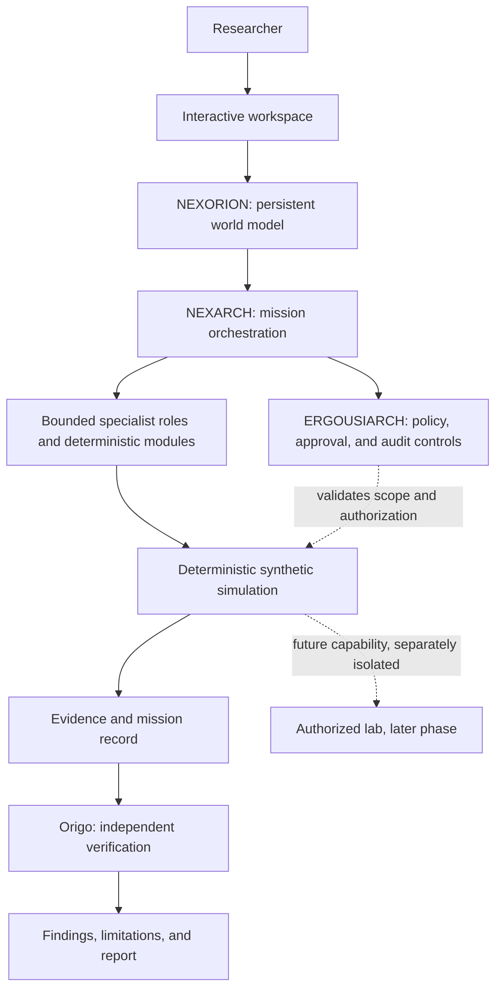

# NEXORION

**An AI-coordinated cybersecurity research and simulation universe.**

NEXORION is a proposed persistent digital environment in which a researcher can explore a modeled world, investigate security evidence, develop hypotheses, run reproducible simulations, and independently verify findings. The concept combines a stateful world model, coordinated specialist roles, explicit governance, and a future isolated lab for separately authorized experiments.

> **Project status (10 October 2026):** Stage 4 work is recorded on the `stage4-implementation` branch, not as a production release. The Stage 4 acceptance record documents passing frontend build and Playwright checks, backend tests and Ruff on Python 3.11/3.12, and PostgreSQL 16 migration/API checks for the recorded code-bearing commit. Re-check CI on the final pull-request head before merge. A hosted smoke test and human visual sign-off have not been performed; production hosting is blocked by same-origin cookie/CSRF handling, missing owner bootstrap, and the need for the full API suite on PostgreSQL 16. See the [Stage 4 acceptance record](docs/stage4/02_ACCEPTANCE_AND_SECURITY_STATUS.md) and [implementation tracker](docs/stage4/03_IMPLEMENTATION_TRACKER.md). This project follows a hard **$0 spend ceiling**: local development and CI first, no paid infrastructure or billable model APIs, and no payment card on hosting accounts.

## The three identities

- **NEXORION — the digital universe:** the persistent environment and world model for entities, relationships, missions, scenarios, evidence, and research history.
- **NEXARCH — the central intelligence:** the primary mission reasoning and orchestration layer. It decomposes user intent into bounded work and coordinates specialists; it cannot authorize its own consequential actions.
- **ERGOUSIARCH — the governing authority:** the governance concept for policy, approval, audit, and execution-gate controls. It must be realized through deterministic software; the name itself is not an enforcement mechanism.

**Archon** is orchestration support under NEXARCH, not a competing primary orchestrator. **Origo** is the independent verification role. Other agent names and aliases in the source material are bounded role concepts, not a requirement to run a separate LLM for every name.

## Concept and distinguishing goals

- A persistent, inspectable digital world rather than a chat-only interface.
- Mission-based research with explicit objectives, scope, constraints, and completion criteria.
- Specialist roles with bounded responsibilities, typed handoffs, and prohibited authorities.
- Repeatable deterministic simulation and baseline comparison.
- Evidence provenance and independent verification separated from AI-generated hypotheses.
- An adaptive multimodal interface as a future direction, not a current capability claim.
- A staged path to an isolated lab only after separate security design, isolation validation, and explicit authorization.

## Proposed architecture

This diagram represents the proposed design, not a verified implementation. The backend must remain authoritative for world state, permissions, and mission records; a UI graph or an agent's explanation is not a security boundary.

## Mission lifecycle

1. **Interpret intent:** capture the research question, assumptions, and constraints.
2. **Define scope:** create a versioned mission contract with permitted actions, exclusions, autonomy tier, and acceptance criteria.
3. **Validate and plan:** apply deterministic scope/policy checks and produce a bounded, versioned plan.
4. **Establish baseline:** capture the initial modeled state and evidence references.
5. **Execute within scope:** initially use deterministic synthetic fixtures only.
6. **Verify independently:** check provenance, expected outcomes, contradictions, and missing evidence.
7. **Report and retain:** record findings, limitations, linked evidence, and a reproducible mission outcome.

A blocked approval or unclear scope prevents execution. Failure, dispute, inconclusive evidence, or cancellation must never be reported as success.

## Stage 1 blueprint

Stage 1 is documentation-only: it defines requirements, contracts, lifecycle rules, security boundaries, technology decisions, a synthetic scenario, traceability, and owner decisions before application code is built.

- [Stage 1 index](docs/stage1/00_STAGE1_INDEX.md)
- [Requirements catalogue](docs/stage1/01_REQUIREMENTS_CATALOGUE.md)
- [Data and API contracts](docs/stage1/02_DATA_AND_API_CONTRACTS.md)
- [Mission lifecycle and recovery](docs/stage1/03_MISSION_LIFECYCLE.md)
- [Governance and security controls](docs/stage1/04_GOVERNANCE_SECURITY_CONTROLS.md)
- [Technology decision records](docs/stage1/05_TECHNOLOGY_DECISION_RECORDS.md)
- [Synthetic authentication-failure scenario](docs/stage1/06_SYNTHETIC_AUTH_FAILURE_SCENARIO.md)
- [Requirement-to-test traceability and acceptance](docs/stage1/07_REQUIREMENT_TO_TEST_TRACEABILITY.md)
- [Open owner decisions](docs/stage1/08_OPEN_DECISIONS.md)
- [Stage 1 delivery review](docs/stage1/09_STAGE1_DELIVERY_REVIEW.md)
- [Source-of-truth addendum](docs/stage1/10_SOURCE_OF_TRUTH_ADDENDUM.md)
- [Roadmap addendum](docs/stage1/11_ROADMAP_ADDENDUM.md)

Stage 1 is **proposed for owner review** until the requirements and acceptance checklist are explicitly accepted. These documents specify expected future behavior; they do not prove runtime, API, simulation, or security tests have passed.

## Stage 2 application foundation

Stage 2 implements the first executable backend slice on the stage2 branch for review. It includes a FastAPI API, Argon2 password hashing, server-side revocable sessions, CSRF checks for state-changing cookie-authenticated requests, server-side workspace authorization, synthetic-only mission drafts, structured errors, audit events, SQLAlchemy models, an Alembic migration, and automated API tests.

- [Stage 2 index](docs/stage2/00_STAGE2_INDEX.md)
- [Application foundation notes](docs/stage2/01_APPLICATION_FOUNDATION.md)
- [Security and test matrix](docs/stage2/02_SECURITY_AND_TESTS.md)
- [Backend local setup and API walkthrough](backend/README.md)

Local evidence for the Stage 2 working tree: 13 API tests pass; Python compilation passes; and the initial Alembic migration applies to a local SQLite test database. The pull-request CI result and PostgreSQL integration remain to be verified. The local-account adapter does not settle production SSO/MFA, account provisioning, deployment, data-retention, or other open owner decisions.

## Stage 3 digital-world and simulation

The Stage 3 branch adds a verified first executable world-and-simulation slice on top of the Stage 2 backend. GitHub Actions passed on commit `04b13f4a3f21e07c242e268fe45ab7396ab4954a`, including Python 3.11/3.12 tests and lint, fresh SQLite migration round-trips, PostgreSQL 16 migration round-trip, and an end-to-end PostgreSQL API smoke test. It provides workspace-scoped synthetic entities and relationships, versioned SHA-256 baseline snapshots, a fixed authentication-failure scenario and benign control, idempotent simulation run records, provenance-linked evidence, and deterministic fixture consistency checks.

- [Stage 3 index and acceptance gate](docs/stage3/00_STAGE3_INDEX.md)
- API setup and walkthrough: [backend README](backend/README.md)

Those capability notes describe the **Stage 3 branch scope**: only registered synthetic fixtures execute, and no network scanning, shell commands, real-credential attempts, live telemetry ingestion, or live-system mutation are exposed. Stage 4 adds the visual workspace and persisted independent Origo verification described below; those additions do not authorize live-system activity.

## Stage 4 — Workspace, Origo verification and reports

The `stage4-implementation` working branch integrates the visual workspace with the authenticated API, workspace-scoped graph operations, registered synthetic scenarios, persisted Origo verification, and server-generated JSON/Markdown research reports. The branch's [Stage 4 acceptance record](docs/stage4/02_ACCEPTANCE_AND_SECURITY_STATUS.md) records frontend production-build and Playwright E2E passes, backend tests/Ruff on Python 3.11 and 3.12, and SQLite/PostgreSQL 16 migration plus PostgreSQL API integration checks for its code-bearing acceptance commit.

**Close-out is still pending:** the acceptance record does not document a hosted smoke test or human visual sign-off; the latest branch-head CI must be rechecked before merge. Same-origin deployment, production owner bootstrap, and the full API suite on PostgreSQL 16 are separate readiness blockers. No Stage 4 merge SHA is recorded here because a merge has not been verified. See the [implementation tracker](docs/stage4/03_IMPLEMENTATION_TRACKER.md). Stage 4 remains synthetic-only and is not a production release.

## Core documentation

- [Implementation tracker, $0 plan, blockers, and acceptance gates](docs/stage4/03_IMPLEMENTATION_TRACKER.md)
- [Stage 4 acceptance and security verification](docs/stage4/02_ACCEPTANCE_AND_SECURITY_STATUS.md)
- [Concept and scope](docs/CONCEPT.md)
- [System architecture](docs/ARCHITECTURE.md)
- [Agent registry](docs/AGENT_REGISTRY.md)
- [Mission coordination](docs/COORDINATION.md)
- [Governance and safety](docs/GOVERNANCE_AND_SAFETY.md)
- [Technology stack](docs/TECH_STACK.md)
- [Roadmap](docs/ROADMAP.md)
- [Threat model](docs/THREAT_MODEL.md)
- [Source of truth and open decisions](docs/SOURCE_OF_TRUTH.md)

## Original research and planning files

The original research files are preserved as foundational inputs. They may contain earlier role names, phase numbering, or architectural alternatives; conflicts are tracked instead of silently erasing the history.

- [AI Interactive Cybersecurity Architecture](AI_Interactive_Cybersecurity_Architecture.md)
- [Unified NEXORION concept and agent architecture](nexorion_unified_concept_agent_architecture.md)
- [Agent Identity, Responsibilities, and Coordination](Agent%20Identity%2C%20Responsibilities%2C%20and%20Coordination.md)
- [Hybrid cybersecurity lab simulation architecture](hybrid_cybersecurity_lab_simulation_architecture.md)
- [Hybrid implementation strategy roadmap](hybrid_implementation_strategy_roadmap.md)
- [Implementation notes](Implementation.md)
- [Project checklist](Checklist.md)

## Technology direction

The planning documents propose React + TypeScript + Vite for the workspace, React Flow for graph interaction, Python + FastAPI + Pydantic for an API boundary, PostgreSQL for durable metadata, NetworkX for early graph analysis, and WebSockets or Server-Sent Events where live updates are justified. Temporal is a candidate for durable workflows, not a committed dependency. Kafka/Redpanda, a dedicated graph database, 3D rendering, and a full agent framework are deferred until requirements demonstrate a need.

See [technology decision records](docs/stage1/05_TECHNOLOGY_DECISION_RECORDS.md). These are proposals, not a verified dependency manifest or deployed stack.

## Security principles

- Treat model/agent output as untrusted data, not authority.
- Enforce scope and permissions through deterministic checks at the execution boundary.
- Require explicit, narrow, time-bounded authorization where policy demands it; re-check before execution.
- Separate planning, approval, execution, and independent verification.
- Keep synthetic simulation distinct from user-supplied or observed evidence.
- Preserve evidence provenance and audit history; corrections create linked records.
- Fail closed when scope, approval, policy, or verifier status cannot be established.
- Never scan, test, or modify systems without explicit authorization.

## Development status and setup

The repository contains the Stage 2 API foundation, Stage 3 synthetic world/simulation workflow, and Stage 4 workspace UI, Origo verification, and report-generation work on the `stage4-implementation` branch. Use [backend local setup](backend/README.md) and the [Stage 4 acceptance record](docs/stage4/02_ACCEPTANCE_AND_SECURITY_STATUS.md) for commands and the recorded automated evidence. The final PR-head CI result still needs to be checked before merge. This is not a production release: owner bootstrap, same-origin frontend/API deployment, complete PostgreSQL 16 API-suite coverage, hosted smoke testing, and human visual sign-off remain open. The [implementation tracker](docs/stage4/03_IMPLEMENTATION_TRACKER.md) is the single working status register and retains the hard $0 spend cap.

## Roadmap

The intended sequence is: reconcile the blueprint; accept contracts and guardrails; implement the persistent world and mission foundation; build the synthetic authentication-failure vertical slice; add independent verification and evidence handling; introduce durable orchestration and bounded agent roles; then evaluate model-backed interaction and a separately isolated lab. Operational hardening and scaling should follow demonstrated requirements. See [roadmap](docs/ROADMAP.md), [implementation tracker](docs/stage4/03_IMPLEMENTATION_TRACKER.md), and [Stage 1 acceptance](docs/stage1/07_REQUIREMENT_TO_TEST_TRACEABILITY.md).

## Licensing and contributions

No license or contribution policy should be inferred from these documents. License choice, contribution workflow, support expectations, and a security vulnerability reporting channel remain owner decisions. Do not submit or run tests against systems without authorization.
