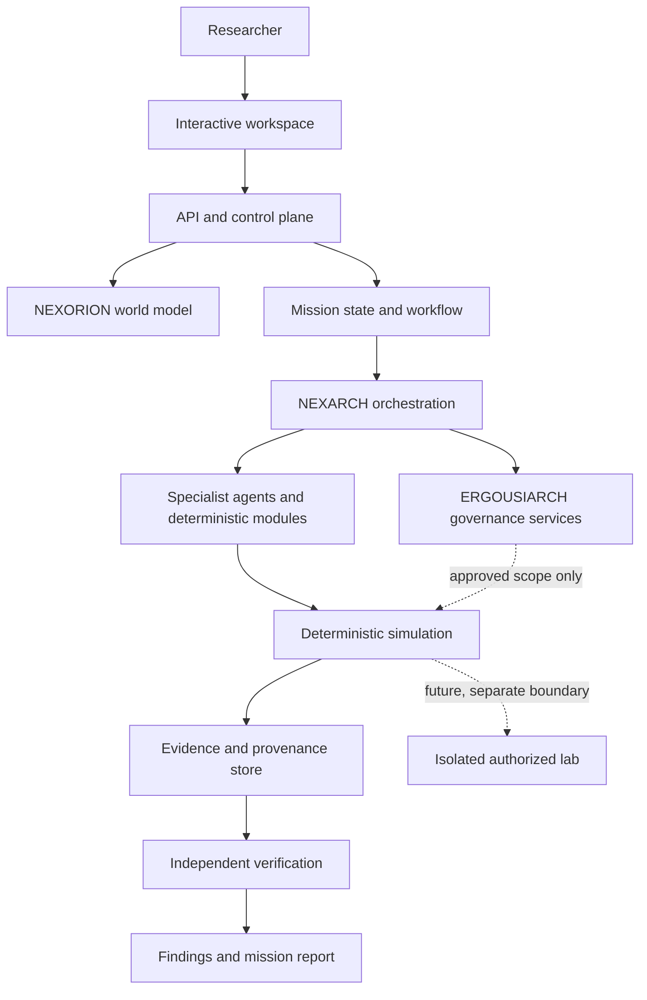

# System Architecture

**Status:** Proposed logical architecture. Component deployment and implementation are unverified.

## Architecture principles

- Persistent world state is distinct from transient conversation context.
- Mission state and evidence have explicit schemas and identifiers.
- Agent roles are bounded; orchestration is not authorization.
- Deterministic services handle validation, policy, state transitions, and repeatable simulation where possible.
- Independent verification is separate from the agent or process that generated a hypothesis.
- The lab boundary is distinct from the simulation and application control plane.

## Logical layers

1. **Interactive experience:** workspace for navigating the world, missions, evidence, results, and future adaptive interaction.
2. **API/control plane:** authenticated API, input validation, mission operations, authorization checks, and event delivery.
3. **World model:** entities, relationships, system state, baselines, scenarios, and mission references.
4. **Mission orchestration:** durable workflow state, task dependencies, handoffs, retry and cancellation rules.
5. **Agent and deterministic module layer:** bounded specialists plus ordinary software modules for parsing, policy, simulation, and validation.
6. **Simulation and lab boundary:** deterministic synthetic environment first; a separate, isolated lab only in a later authorized phase.
7. **Evidence and verification:** append-oriented evidence records, provenance, baseline comparisons, verifier results, and reports.
8. **Persistence and observability:** durable application records, audit events, operational telemetry, and health signals.

## Mermaid component view

The governance-to-execution relationship is a requirement, not a claim that a software enforcement path already exists. In implementation, a consequential action should require a machine-checkable authorization decision at the execution boundary.

## Data flow

A mission request is validated and converted into a mission contract. The world model supplies relevant state and baseline data. NEXARCH creates a bounded plan and delegates permitted tasks. Deterministic modules and approved agents produce events and candidate findings. Evidence records capture inputs, timestamps, provenance, tool or simulation version, and relationships to the mission. A separate verifier checks the claim against evidence and expected outcomes. The reporting layer exposes the conclusion, confidence limitations, unresolved questions, and supporting evidence.

## Trust boundaries

- **User to control plane:** authenticate identity, validate inputs, authorize workspace access.
- **Orchestrator to specialist:** constrain each task to an explicit scope and allowed tools.
- **Model output to execution:** treat generated content as untrusted; validate arguments and permissions deterministically.
- **Simulation to evidence:** label synthetic data and simulated outcomes as such.
- **Application to lab:** separate credentials, networks, execution identities, and data stores; require explicit approval and isolation checks.
- **Hypothesis generation to verification:** verifier should use recorded evidence and an independent check path rather than merely repeat the originating agent's reasoning.

## Failure handling requirements

- Unknown scope or authorization: stop the consequential action.
- Missing baseline or incomplete evidence: mark the result incomplete rather than infer success.
- Agent timeout or malformed output: record the failure and apply bounded retry or escalation rules.
- Verifier disagreement: preserve both the claim and counter-evidence; do not silently mark the mission successful.
- Simulation/lab boundary failure: do not fall back to a less controlled execution route.
- Cancellation: prevent new actions, record state, and confirm the execution boundary has stopped work where applicable.

## Persistence concepts

The data model should distinguish users/workspaces, world entities, relationships, missions, mission contracts, task executions, scenarios, baselines, evidence items, approvals, policy decisions, verification results, reports, and audit events. Exact schemas and retention policy remain implementation decisions.
