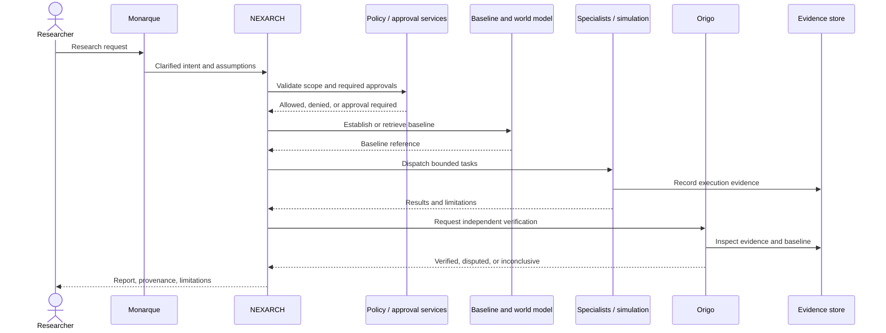

# Mission Coordination

**Status:** Proposed workflow.

## Mission lifecycle

The diagram describes intended interactions. Exact API calls, queues, and state machines remain to be implemented.

## Mission contract

Before execution, persist:
- Mission ID, owner/workspace, objective, and rationale.
- In-scope assets and environment; explicit exclusions.
- Permitted actions and prohibited actions.
- Simulation versus lab mode.
- Required approval, approving identity, scope, and expiry where applicable.
- Baseline references, success criteria, and stop conditions.
- Resource budget, deadline, cancellation behavior, and expected evidence.
- Verification method and reporting requirements.

## Handoffs

Each handoff should carry a typed task envelope: task ID, parent mission, assigned role, inputs, provenance, allowed operations, output schema, time/resource limits, and completion state. Agents should not rely on hidden conversational context as the only source of mission state.

## State model

A minimal proposed state model is:

`DRAFT → NEEDS_CLARIFICATION → READY_FOR_REVIEW → BLOCKED_OR_APPROVAL_REQUIRED → AUTHORIZED → RUNNING → VERIFYING → COMPLETED | INCONCLUSIVE | FAILED | CANCELLED`

Not every mission uses every state. A policy denial must not be represented as a successful run. Completion should require the defined acceptance criteria and the necessary verification record.

## Failure and recovery

- **Ambiguous intent:** ask for clarification; do not infer permission.
- **Policy denial or absent approval:** block the action and record the decision.
- **Resource exhaustion:** stop or checkpoint safely; record partial output.
- **Agent failure:** bounded retries only for idempotent tasks; otherwise escalate or mark blocked.
- **Conflicting results:** preserve conflicting evidence and report the disagreement.
- **Verifier failure:** mission remains unverified or inconclusive.
- **Cancellation:** stop scheduling new work and confirm active execution is stopped.
- **Lab isolation failure:** fail closed; never redirect execution to a less controlled environment.

## Reporting

A mission report should include the question, scope, environment/mode, baseline, methods, actions, evidence references, results, verification status, uncertainties, limitations, failed steps, approval/audit references, and reproducibility instructions. Simulated evidence must be visibly labeled as simulated.
