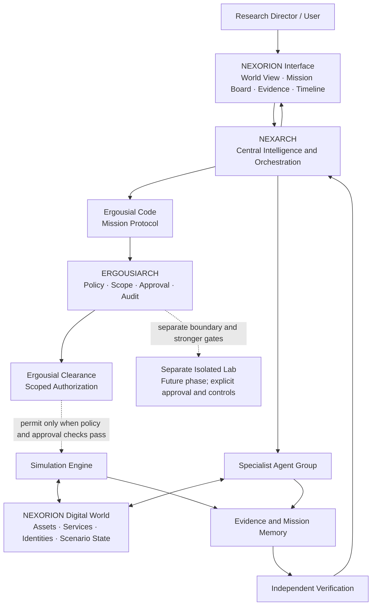
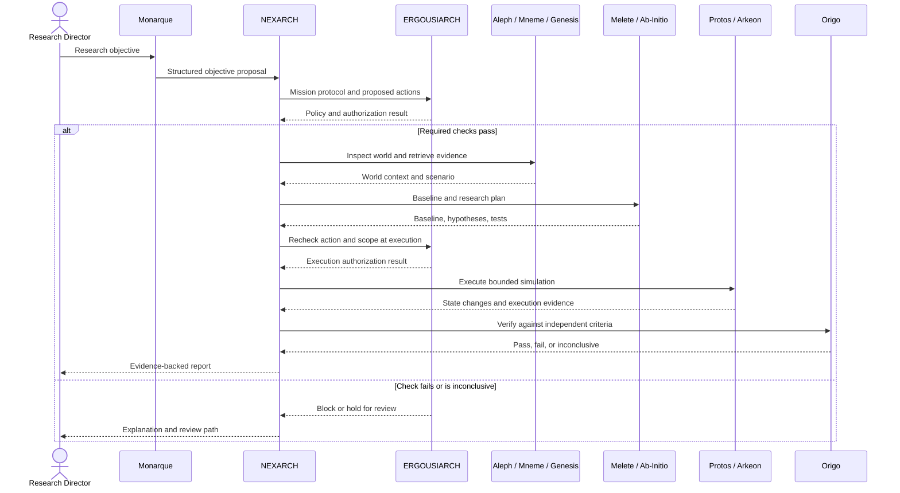

# NEXORION — Cyber Research Universe
## Unified Concept, Agent Architecture, Responsibilities, and Coordination

**Status:** Conceptual architecture and planning document  
**Product identity:** NEXORION  
**Central intelligence:** NEXARCH  
**Governance authority concept:** ERGOUSIARCH  
**Category:** AI-coordinated cybersecurity research and simulation environment

---

## 1. Executive Summary

**NEXORION** is a proposed persistent, interactive digital environment for cybersecurity research, simulation, investigation, and controlled experimentation. It is intended to feel like an evolving digital world rather than a conventional dashboard or a chatbot.

The concept unifies three names into distinct roles:

- **NEXORION — The Digital Universe:** the persistent world containing simulated infrastructure, assets, identities, services, scenarios, evidence, research history, and experiment branches.
- **NEXARCH — The Central Intelligence:** the orchestration layer that interprets approved objectives, coordinates specialist agents, plans missions, tracks progress, and manages resources.
- **ERGOUSIARCH — The Governing Authority:** the governance and authorization framework that defines permitted actions, scope, approvals, policy checks, audit records, and verification requirements.

The central principle is:

> **A living cyber world, an intelligence that investigates, and an authority that constrains.**

The three names describe conceptual responsibilities, not three independently intelligent entities that automatically trust one another. In a real implementation, authorization, policy enforcement, isolation, and auditability must be enforced by testable software controls, not by an LLM's promise.

## 2. Product Vision and Niche

NEXORION aims to combine capabilities that are often split across separate tools:

1. **Persistent digital world:** a durable model of systems, services, identities, network relationships, dependencies, and their simulated states.
2. **Adaptive multimodal interface:** conversational interaction alongside live topology, timelines, mission boards, evidence panels, and simulation controls.
3. **Multi-agent research:** specialized agents with bounded responsibilities, typed inputs and outputs, and explicit handoffs.
4. **Repeatable experiments:** scenario replay, controlled variable changes, snapshots, comparisons, and evidence preservation.
5. **Independent verification:** checks that evaluate results against assertions and evidence rather than simply accepting the planner's report.
6. **Governed autonomy:** routine, in-scope work can proceed within defined limits; consequential actions require explicit approval.
7. **Separate authorized lab:** a future isolated execution environment for approved real-world or lab testing, separated from the simulation and the orchestration control plane.

The differentiator is not simply “AI for cybersecurity.” It is a **persistent cyber research universe with coordinated intelligence, reproducible experiments, and enforceable governance**.

## 3. Naming and Conceptual Boundaries

| Name | Conceptual role | Primary question |
|---|---|---|
| **NEXORION** | Platform and digital universe | What world are we exploring? |
| **NEXARCH** | Central intelligence and mission orchestration | How should the system pursue the mission? |
| **ERGOUSIARCH** | Governance doctrine and authorization framework | What is permitted, and under whose authority? |

### 3.1 NEXORION — The Digital Universe

NEXORION represents the entire user-facing platform and persistent cyber environment. It owns the world model, simulated assets, scenario state, experiment branches, evidence records, and research history.

### 3.2 NEXARCH — The Central Intelligence

NEXARCH interprets a user's high-level research objective, coordinates specialist modules and agents, maintains mission state, and presents progress and findings. It does **not** grant itself permission to perform consequential actions.

### 3.3 ERGOUSIARCH — The Governing Authority

ERGOUSIARCH represents the platform's governing rules and authorization process. It specifies scope, permitted actions, required approvals, expiry, audit requirements, and verification conditions. It should be implemented as a policy and authorization system with explicit records and deterministic checks, not merely as a conversational persona.

Related protocol concepts:

- **Ergousial Code:** a structured mission protocol containing the objective, scope, steps, permitted actions, constraints, stop conditions, and success criteria. It is not a security bypass or a claim of unbreakability.
- **Ergousial Clearance:** an authorization record or process defining who or what may perform which action, in what scope, under which approval, and until what expiry. It is not invisibility, immunity, or unrestricted authority.

These related concepts can remain named governance constructs within ERGOUSIARCH.

## 4. Architecture at a Glance

**Interpretation:** the user defines an objective; NEXARCH turns it into a coordinated mission; ERGOUSIARCH evaluates governance and authorization; specialist agents investigate or prepare work; the simulation engine executes only permitted operations; evidence is retained; and independent verification checks the outcome before NEXARCH reports back.

The future real lab must be isolated from the ordinary simulation and must not inherit broad permissions merely because an agent can operate in NEXORION.

## 5. Agent Architecture and Responsibilities

The names below are the proposed agent registry. They describe intended responsibilities, not already implemented agents. Begin with typed modules and deterministic functions; introduce model-backed autonomy only when module contracts, logging, and tests are dependable.

| Agent / module | Responsibility | Inputs | Outputs / handoff | Limits |
|---|---|---|---|---|
| **NEXARCH — Mission Orchestration** | Coordinates the mission, delegates tasks, tracks state, resolves handoffs, and reports results | Approved objective, mission protocol, current state | Task graph, status, consolidated report | Cannot approve its own consequential actions or override policy |
| **Monarque — User Intent** | Converts a high-level user request into a clear, reviewable objective proposal | User request, clarifying context | Objective, assumptions, questions, expected outcome | Must surface ambiguity; does not authorize execution |
| **Archon — Mission Orchestration Support** | Coordinates specialist-agent sequencing and dependency-aware execution under NEXARCH | Mission plan, agent status | Execution schedule, dependency updates | Cannot grant permissions or bypass NEXARCH's controls; can be merged into NEXARCH in an initial build |
| **Dynas — Resource Management** | Manages compute, time, concurrency, quotas, and mission budgets | Mission estimate, resource policy, current load | Resource allocation proposal, limit alerts | Cannot increase its own limits or bypass global quotas |
| **Kratos — Policy Enforcement** | Evaluates requested operations against rules, scope, prohibited actions, and safety constraints | Proposed action, policy set, target scope | Permit/deny decision with reasons | Denies by default when required policy information is missing; no self-exemption |
| **Exousia — Approval Validation** | Verifies approver identity, approval scope, action match, expiry, and revocation | Action request, approval record, identity and scope | Valid/invalid authorization result | Does not create its own approval or expand the approved scope |
| **Prytanie — Governance Operations** | Manages review queues, exception handling, escalations, and governance records | Policy findings, approval requests, alerts | Review task, escalation, audit entry | Human approval remains required where policy says so |
| **Aleph (Alpha callsign) — World Intelligence** | Maintains the world model and reasons about assets, relationships, and dependencies | World graph, observed events, scenario state | Relevant entities, dependency map, impact hypotheses | Distinguishes observed facts from inferred relationships |
| **Genesis (Genarch callsign) — Scenario Creation** | Creates repeatable scenarios from templates and defined parameters | Objective, world model, scenario templates | Scenario specification and expected outcomes | Uses synthetic or explicitly authorized targets; no uncontrolled external targeting |
| **Primus (Prime/Prior callsigns) — Priority Arbitration** | Ranks and schedules missions using explicit urgency, impact, and dependency rules | Mission queue, deadlines, priorities, policy | Priority recommendation and schedule | Cannot use priority to override authorization or safety gates |
| **Ab-Initio — Baseline Establishment** | Captures the starting state and assumptions before an experiment | World state, scenario setup, baseline schema | Versioned baseline, assumptions, initial measurements | Must preserve provenance and indicate missing baseline data |
| **Origo — Independent Verification** | Tests outcomes against assertions, acceptance criteria, and evidence independently of the planner | Expected properties, outputs, evidence, test results | Pass/fail/inconclusive verdict with supporting evidence | Must not simply repeat the executing agent's conclusion; may request rerun or human review |
| **Mneme — Evidence Memory** | Stores and retrieves mission history, evidence, provenance, and links between findings | Events, artifacts, source metadata, mission IDs | Searchable evidence, history, provenance chain | Preserves access controls, integrity metadata, retention rules, and source attribution |
| **Melete — Research Strategy** | Develops hypotheses, experiment plans, and discriminating tests | Objective, prior evidence, world model | Hypotheses, test plan, predicted outcomes | Labels uncertainty; experiments remain within approved scope |
| **Arkeon — Environment Stewardship** | Manages world lifecycle, snapshots, resets, consistency, and experiment branches | World state, snapshot requests, lifecycle policy | Snapshot, reset/branch plan, consistency report | Destructive resets or state-changing operations require appropriate safeguards and approval |
| **Protos — Simulation Execution** | Runs deterministic simulation steps and records the resulting state transitions | Validated scenario, baseline, authorized simulation plan | Events, state changes, execution logs | Runs only in the assigned environment and within enforced resource and action limits |

### 5.1 Alias and consolidation policy

To avoid creating duplicate agents for alternate names:

- **Aleph** is the agent name; **Alpha** is its callsign.
- **Genesis** is the agent name; **Genarch** is its callsign.
- **Primus** is the agent name; **Prime** and **Prior** are callsigns or historical aliases.
- **Archon** can begin as a mission-coordination module within NEXARCH, rather than a separate autonomous agent.
- **ERGOUSIARCH**, **Ergousial Code**, and **Ergousial Clearance** are governance concepts and mechanisms, not additional free-running agents.
- **NEXORION** is the platform/world, not an agent.

The initial implementation should not create a separate model call for every row. Some responsibilities can be deterministic services or modules, combined behind stable interfaces until there is a demonstrated need to separate them.

## 6. Agent Coordination and Mission Lifecycle

### Phase 1 — Understand the request

1. **Monarque** translates the user's request into a structured objective.
2. NEXARCH asks clarifying questions when the target, expected result, or permitted scope is ambiguous.
3. The objective records assumptions, desired evidence, and success criteria.

### Phase 2 — Establish the mission contract

4. NEXARCH creates a mission plan and an **Ergousial Code** protocol.
5. **Kratos** checks whether the planned actions comply with policy and target scope.
6. **Exousia** validates any required **Ergousial Clearance**, including identity, action, scope, expiry, and approval.
7. **Prytanie** routes unresolved or exceptional cases for review.
8. If a required check fails or is inconclusive, the affected operation is blocked or held for review.

### Phase 3 — Understand and prepare the world

9. **Aleph** maps relevant assets, services, identities, and dependencies in NEXORION.
10. **Mneme** retrieves relevant history and evidence with provenance.
11. **Genesis** builds the scenario using controlled templates and parameters.
12. **Ab-Initio** captures the baseline.
13. **Melete** proposes hypotheses and tests that can distinguish between competing explanations.
14. **Primus** prioritizes work; **Dynas** checks resource and concurrency limits.
15. NEXARCH consolidates the plan and schedules the work.

### Phase 4 — Execute in a controlled environment

16. The policy and authorization gates are checked at the point of execution, not just at planning time.
17. **Protos** runs deterministic simulation steps inside the designated simulation environment.
18. **Arkeon** manages snapshots, branches, resets, and environment consistency.
19. Agents record relevant observations, state changes, and artifacts through **Mneme**.
20. If execution drifts outside scope, reaches a stop condition, or loses required authorization, the system halts the affected work and records the reason.

### Phase 5 — Verify and report

21. **Origo** checks the outcome against independent assertions and the expected result.
22. If the result fails, is incomplete, or is inconclusive, NEXARCH may ask for additional evidence, a bounded rerun, a revised hypothesis, or human review.
23. NEXARCH creates a report containing the objective, scope, steps taken, evidence, verification status, limitations, and recommendations.
24. NEXORION retains the mission record so the experiment can be revisited, compared, or branched later.

### Coordination sequence

## 7. Authority, Autonomy, and Safety Model

The system should support independent lab work only within explicit boundaries.

### Autonomy tiers

| Tier | Allowed behavior | Example |
|---|---|---|
| **Tier 0 — Observe** | Read permitted world state and evidence | Inspect synthetic authentication logs |
| **Tier 1 — Plan** | Draft plans, hypotheses, and scenario proposals | Suggest tests for a simulated login failure |
| **Tier 2 — Simulate** | Execute bounded, reversible actions in the synthetic world | Replay a synthetic authentication incident |
| **Tier 3 — Approved lab action** | Perform a specifically authorized action inside a separately isolated lab | Run an approved test against a designated lab service |
| **Tier 4 — Consequential action** | Actions that could affect real systems, data, availability, or external parties | Require explicit authorization and safeguards; some actions should remain disallowed |

Higher tiers do not activate automatically. Every action must be evaluated against scope, authorization, policy, risk, and current environment state.

### Required control principles

- **Least privilege:** agents and services receive only the access needed for their tasks.
- **Explicit scope:** every mission identifies the allowed environment and target set.
- **Independent enforcement:** software controls enforce decisions outside the model's natural-language output.
- **Approval binding:** approvals are tied to a specific actor, action, target scope, and validity period.
- **Execution-time checks:** policy and approval are revalidated before consequential steps.
- **Auditability:** record who requested, proposed, approved, executed, and verified each action.
- **Reproducibility:** preserve versions of scenarios, inputs, models/configurations where relevant, and results.
- **Safe failure:** missing policy, ambiguous scope, expired approval, or failed verification should block or hold the affected action.
- **Isolation:** the real lab has its own boundary, credentials, network controls, resource limits, and teardown procedure.
- **Human oversight:** approvals cannot be self-issued by the agent requesting the action.

## 8. World Model and Evidence Structure

NEXORION's world can represent:

- Assets: applications, hosts, services, identities, databases, and security controls.
- Relationships: dependencies, trust relationships, network connections, ownership, and data flows.
- State: current simulated condition, configuration, health, and known weaknesses.
- Events: authentication failures, policy violations, alerts, simulated attacker actions, and defensive responses.
- Missions: objective, scope, plan, status, approvals, stop conditions, and results.
- Evidence: logs, artifacts, timestamps, source, integrity metadata, and links to findings.
- Experiments: baseline, hypothesis, changed variables, expected outcome, actual outcome, and verifier result.
- Branches: alternate scenarios derived from a saved world snapshot.

Keep **observed facts**, **agent inferences**, **assumptions**, and **unverified hypotheses** visibly distinct. The user interface should make it possible to trace a claim back to its supporting evidence.

## 9. Proposed Technology Direction

This is a proposed technology direction, not a claim that components have already been implemented or that every service is needed from day one.

| Area | Initial direction | Purpose |
|---|---|---|
| Interactive frontend | React + TypeScript + Vite | Adaptive research workspace |
| World topology | React Flow initially; evaluate Cytoscape.js for larger graphs | Interactive asset and dependency graph |
| Optional 3D | Three.js when 3D adds practical value | Spatial visualization, not a requirement for the first milestone |
| API/control plane | Python + FastAPI + Pydantic | Typed APIs and request validation |
| Primary persistence | PostgreSQL | Missions, users, world metadata, approvals, evidence references, and audit records |
| Graph analysis | NetworkX initially | Dependency and relationship analysis |
| Live updates | WebSockets initially | Mission progress and changing simulation state |
| Durable workflow orchestration | Temporal when operationally justified | Recoverable multi-step missions and retries |
| Simulation | Deterministic Python modules at first | Reproducible state transitions and scenario execution |
| Evidence and artifacts | Database metadata plus controlled object/file storage as required | Retention, provenance, integrity, and retrieval |
| Event streaming | Add Kafka or Redpanda only if scale and event throughput justify it | High-volume asynchronous event distribution |
| Packaging | Containerized development and isolated execution environments | Repeatable setup and clearer boundaries |

### Architecture principles

1. Start with typed modules and explicit interfaces; do not begin with a swarm of unconstrained LLM agents.
2. Keep policy enforcement, approval validation, and verification separate from the agent that proposes or executes work.
3. Keep durable mission state outside conversational context.
4. Treat the world graph as a useful model, not as unquestionable truth.
5. Add workflow infrastructure and event streaming only when recovery, throughput, or operational needs justify their cost.
6. Design the isolation boundary for the future lab early, but keep real-world execution out of the first simulation milestone.

## 10. Implementation Roadmap

### Phase 0 — Architecture and contracts
- Define the mission, agent, world entity, evidence, approval, and verification schemas.
- Write the policy model, threat model, and isolation requirements.
- Define stable typed interfaces between modules.
- Decide which initial agent roles are modules rather than separate model-backed agents.

**Exit condition:** schemas, boundaries, threat model, and acceptance criteria are reviewed.

### Phase 1 — A small persistent world
- Build a fictional environment with a web application, authentication service, and database.
- Represent assets and dependencies in the world model.
- Persist world state, missions, and evidence metadata.
- Provide a basic topology view and mission panel.

**Exit condition:** the user can inspect the fictional world and reopen a saved mission.

### Phase 2 — First deterministic investigation
- Implement a synthetic authentication-failure scenario.
- Capture a baseline and synthetic logs.
- Run a deterministic simulation of the failure and a controlled fix.
- Store evidence and state transitions.
- Verify the result against independent assertions.

**Exit condition:** the same scenario can be replayed with reproducible results, and the verifier can detect an unsuccessful fix.

### Phase 3 — Governance and mission coordination
- Implement Ergousial Code as a structured mission contract.
- Implement policy checks and scoped approval records.
- Add execution-time validation, audit events, stop conditions, and safe failure behavior.
- Implement NEXARCH coordination as a typed workflow.

**Exit condition:** an out-of-scope action is reliably blocked and recorded.

### Phase 4 — Research workflow and evidence
- Add hypothesis and experiment records.
- Add evidence provenance and mission history.
- Add branching experiments and comparison views.
- Add live mission updates.

**Exit condition:** the user can compare runs and trace findings to evidence.

### Phase 5 — Carefully bounded agent assistance
- Introduce model-backed Monarque or Melete for objective clarification and hypothesis proposals.
- Validate all outputs against schemas and policy.
- Keep execution deterministic and gated while measuring usefulness and failure modes.
- Expand agent roles only where separation improves reliability.

**Exit condition:** model output cannot bypass typed contracts or policy enforcement.

### Phase 6 — Isolated authorized lab
- Design and test a separate lab environment.
- Establish network, credential, resource, logging, snapshot, and teardown controls.
- Require explicit authorization and target scope.
- Conduct only permitted tests within the approved lab.

**Exit condition:** isolation and authorization controls are independently tested before any consequential lab action.

### Phase 7 — Operational hardening
- Add authentication and workspace authorization.
- Add backup and recovery tests, observability, rate limits, secrets management, dependency auditing, and incident response procedures.
- Test failure, retry, replay, approval expiry, and audit integrity.
- Review privacy, retention, and deletion requirements.

**Exit condition:** documented operational and security acceptance checks pass.

## 11. First End-to-End Demonstration

The first demonstration should be intentionally small and fully synthetic:

1. The user asks NEXORION to investigate repeated authentication failures in a fictional service.
2. Monarque creates a structured objective proposal.
3. NEXARCH prepares the mission protocol.
4. ERGOUSIARCH validates that the scenario and planned actions are within the permitted synthetic environment.
5. Aleph maps the authentication service and its dependencies; Mneme retrieves prior synthetic evidence.
6. Genesis prepares the scenario; Ab-Initio records the baseline.
7. Melete proposes a test plan; Dynas checks the resource budget; Primus schedules the mission.
8. Protos executes deterministic simulation steps while Arkeon maintains state and snapshots.
9. Mneme stores logs and artifacts.
10. Origo independently checks whether the expected condition was restored.
11. NEXARCH presents the timeline, world-state changes, evidence, verification verdict, and recommendations.
12. The user can replay the run or branch a new experiment from the baseline.

This demonstrates the central product idea without needing real network scanning, external targets, or real-system changes.

## 12. Definition of Done for the Core Concept

The first credible version should be able to demonstrate that:

- [ ] The world and missions persist across sessions.
- [ ] Each mission has a clear objective, scope, permitted actions, stop conditions, and success criteria.
- [ ] Agent responsibilities and handoffs are explicit and traceable.
- [ ] A policy failure prevents the affected action.
- [ ] Approval is validated independently and is bound to its intended scope.
- [ ] Simulations are reproducible from recorded inputs and scenario versions.
- [ ] Evidence has provenance and can be retrieved from a mission report.
- [ ] Verification is separate from execution and can return pass, fail, or inconclusive.
- [ ] The interface exposes world state, mission progress, evidence, and uncertainty.
- [ ] The real lab is not implicitly reachable from the simulation environment.
- [ ] Failure, interruption, retries, and recovery leave an auditable record.

## 13. Final Conclusion

**NEXORION is the world. NEXARCH is the intelligence. ERGOUSIARCH is the governing authority.**

Together, they define a coherent identity for a long-term cybersecurity research platform: an interactive digital universe that can be explored and experimented with, an orchestration intelligence that coordinates specialized work, and a governance framework that constrains actions through explicit authorization and independently enforced policy.

The specialist agents contribute focused capabilities rather than behaving as an uncontrolled collection of autonomous personalities. Monarque structures intent; Aleph understands the world; Genesis creates scenarios; Ab-Initio records baselines; Melete designs experiments; Protos runs deterministic simulations; Mneme preserves evidence; Origo independently verifies results; Dynas and Primus manage resources and priority; Kratos and Exousia enforce policy and authorization checks; Prytanie handles governance operations; Arkeon maintains world consistency; and Archon supports mission coordination under NEXARCH.

The correct development strategy is incremental: begin with a persistent synthetic world, a deterministic investigation, evidence provenance, policy gates, and independent verification. Add model-backed agents only when their interfaces and boundaries are testable. Add the real lab as a separately isolated phase after the simulation and governance model has been demonstrated.

**Design maxim:** *Explore freely within the simulation. Act only within scope. Verify with evidence. Escalate when authority is uncertain.*

---

*This document defines a proposed concept and architecture. It does not claim that the named agents, controls, integrations, or lab capabilities are already implemented. Product names and trademarks have not been checked for availability.*
